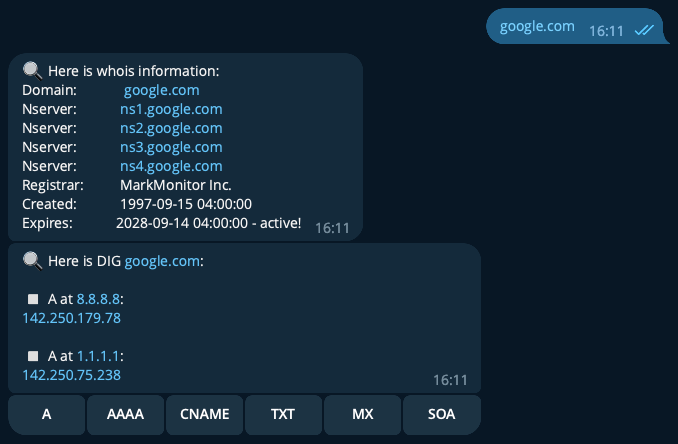

# Whois & dig telegram bot and API

## Information

### Description
This project contains various handy representations of domain analysis utilities such as [whois](https://en.wikipedia.org/wiki/WHOIS) and [dig](https://en.wikipedia.org/wiki/Dig_(command)).
### Content
1. Whois & Dig telegram bot;
2. Whois & Dig REST API;
3. Dockerfiles and docker-compose file for run bot or API in docker containers.

### System requirements:

* Python: 3.7+
* Operating system: Linux or macOS
* Installed whois and dig (`dnsutils`) programs
* Docker (19.03.0+) with docker compose for easy run API

### Tech stack:
[![Python][Python-badge]][Python-url]
[![Docker][Docker-badge]][Docker-url]

For bot: 

[![Python-telegram-bot][Python-telegram-bot-badge]][Python-telegram-bot-url]

For API: 

[![FastAPI][FastAPI-badge]][FastAPI-url]
[![Nginx][Nginx-badge]][Nginx-url]

## Whois & Dig telegram bot

### How to install and use the bot manually:

<details>
<summary>
Instruction
</summary>
<br>

Clone the repo and change directory to it:

```
git clone https://github.com/melax08/whois-and-dig.git && cd whois-and-dig
```

Create and activate a virtual environment:

```
python3 -m venv venv
```

```
source venv/bin/activate
```

Install python dependencies from the file `requirements.txt`:

```
python3 -m pip install --upgrade pip && pip install -r requirements.txt
```

Copy file `.env.example` to `.env` and fill it in:

```shell
cp .env.example .env
nano .env
```

Start the bot:

```
python3 src/wd_telegram_bot.py
```

</details>


### How to run telegram bot via docker:

<details>
<summary>
Instruction
</summary>
<br>

Clone the repo and change directory to it:

```
git clone https://github.com/melax08/whois-and-dig.git && cd whois-and-dig
```

Copy file `.env.example` to `.env` and fill it in:

```shell
cp .env.example .env
nano .env
```

Build the docker image by `Dockerfile.bot`:
```
docker build -t wd_tg_bot -f Dockerfile.bot .
```
Create and run docker container:
```
docker run -it --restart always -d -v ${PWD}/logs:/app/logs --name wd_tg_bot wd_tg_bot
```

</details>


Example of tg bot conversation:



## Whois & Dig REST API

### How to install WD REST API via docker

<details>
<summary>
Instruction
</summary>
<br>

1. Clone the repo and change directory to api_docker dir in it:

```shell
git clone https://github.com/melax08/whois-and-dig.git && cd whois-and-dig
```

2. Copy file `.env.example` to `.env` and fill it in:

```shell
cp .env.example .env
nano .env
```

3. Go to `api_docker` dir and run docker-compose:

```shell
cd api_docker
docker compose up -d
```

</details>

### API usage:
With default nginx config, API runs on http://127.0.0.1.

If you want the api to work on a dedicated ip address, or on a domain, change the directive `server_name` in `api_docker/nginx/default.conf` file.

In a running application, you can find the `swagger documentation` along the path: http://127.0.0.1/docs

### Example of requests to the working API:

Get dig settings like default type or allowed records:
```shell
curl -X GET http://127.0.0.1/api/v1/dig/settings
```

Get dig information about A-records on domain google.com on DNS-servers 1.1.1.1 and 8.8.8.8
```shell
curl -X POST http://127.0.0.1/api/v1/dig \
-H "Content-Type: application/json" \
-d '{"domain": "google.com", "record": "A", "dns": ["1.1.1.1", "8.8.8.8"]}'
```

Get whois information about domain google.com:
```shell
curl -X POST http://127.0.0.1/api/v1/whois \
-H "Content-Type: application/json" \
-d '{"domain": "google.com"}'
```

<!-- MARKDOWN LINKS & BADGES -->
[Python-url]: https://www.python.org/
[Python-badge]: https://img.shields.io/badge/Python-376f9f?style=for-the-badge&logo=python&logoColor=white
[Python-telegram-bot-badge]: https://img.shields.io/badge/python--telegram--bot-4b8bbe?style=for-the-badge
[Python-telegram-bot-url]: https://github.com/python-telegram-bot/python-telegram-bot
[FastAPI-url]: https://fastapi.tiangolo.com
[FastAPI-badge]: https://img.shields.io/badge/FastAPI-005571?style=for-the-badge&logo=fastapi
[Docker-url]: https://www.docker.com
[Docker-badge]: https://img.shields.io/badge/docker-%230db7ed.svg?style=for-the-badge&logo=docker&logoColor=white
[Nginx-badge]: https://img.shields.io/badge/nginx-%23009639.svg?style=for-the-badge&logo=nginx&logoColor=white
[Nginx-url]: https://www.nginx.com/